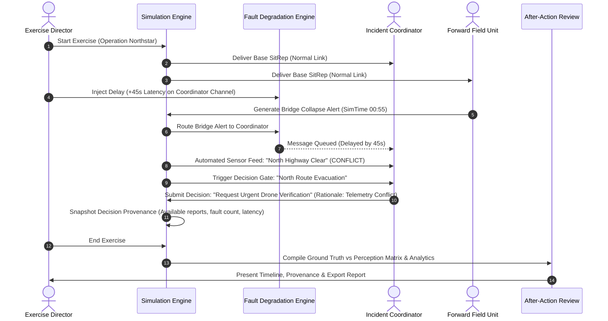
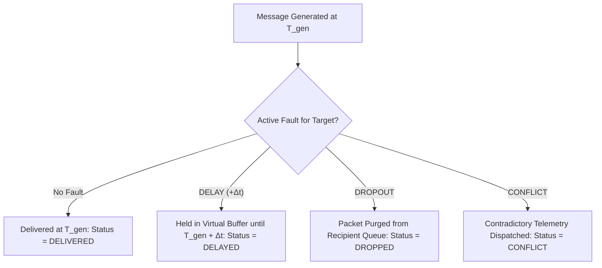
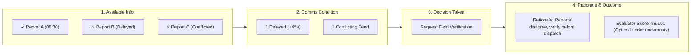
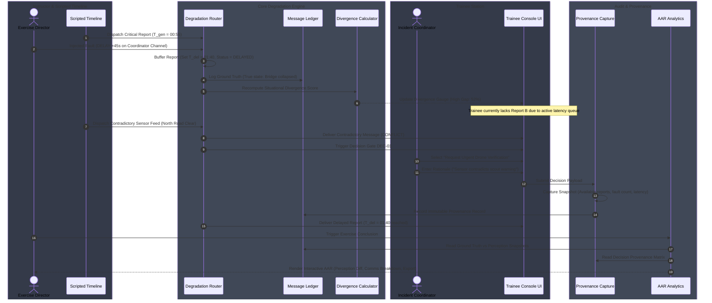
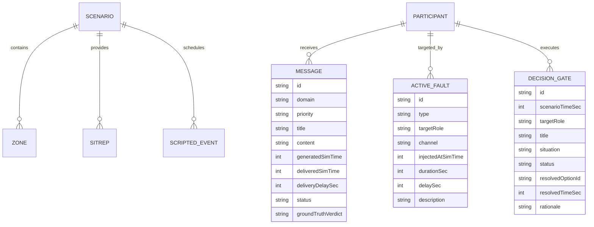

# Immersive Multi-Domain Decision-Making Trainer

A web-based simulation platform designed to evaluate and train operational decision-making under delayed, dropped, and contradictory information conditions.

[](https://www.typescriptlang.org/)
[](https://react.dev/)
[](https://vite.dev/)
[](https://tailwindcss.com/)

**Problem Statement 26248**  
**Ministry of Defence / Defence Services Staff College**  
**Category:** Software | **Theme:** Smart Automation

> **Disclaimer:** This prototype uses fictional, non-operational scenarios and simulated communication faults for training and demonstration purposes. It does not interface with or represent real-world operational defence systems.

---

## Table of Contents

- [Overview](#overview)
- [Problem Statement](#problem-statement)
- [Our Solution](#our-solution)
- [Key Features](#key-features)
- [How It Works](#how-it-works)
- [Communication Degradation Engine](#communication-degradation-engine)
- [Decision Provenance](#decision-provenance)
- [After-Action Review](#after-action-review)
- [System Architecture](#system-architecture)
- [Technology Stack](#technology-stack)
- [Project Structure](#project-structure)
- [Data Model](#data-model)
- [State Dispatch & Internal API](#state-dispatch--internal-api)
- [Real-Time Simulation Events](#real-time-simulation-events)
- [Installation](#installation)
- [Environment Variables](#environment-variables)
- [Running the Application](#running-the-application)
- [Demo Walkthrough](#demo-walkthrough)
- [Screenshots](#screenshots)
- [Testing](#testing)
- [Design Decisions](#design-decisions)
- [Security Considerations](#security-considerations)
- [Limitations](#limitations)
- [Future Scope](#future-scope)
- [Success Criteria](#success-criteria)
- [Team](#team)
- [License](#license)

---

## Overview

The **Immersive Multi-Domain Decision-Making Trainer** is an interactive command-and-control training system designed to replicate the friction of degraded communications during crisis operations.

Traditional simulation software often operates under an implicit assumption of ubiquitous, instantaneous data synchronization across all units. In real-world multi-domain operations, adverse weather, electronic interference, infrastructure destruction, and packet loss produce **asymmetric situational awareness**: different operators perceive contradictory pictures of reality at the same timestamp.

This simulator models the causal chain:

```text
Communication Fault Injected (Delay / Drop / Conflict)
                    ↓
Information Availability Changes per Station
                    ↓
Participants Form Divergent Situational Models
                    ↓
Participants Make Decisions Under Uncertainty
                    ↓
Immutable Decision Provenance is Captured
                    ↓
Evidence-Based After-Action Review (AAR) Reconstructs Reality vs Perception
```

---

## Problem Statement

During emergency and multi-domain operations, decision-makers rarely suffer from a total absence of data; rather, they face:

1. **Delayed Communication**: Reports generated at $T_0$ arrive at $T_0 + \Delta t$, causing actions to be executed based on outdated reality.
2. **Dropped Critical Alerts**: Vital warnings fail to reach specific units due to localized network collapse.
3. **Contradictory Telemetry / Information Conflicts**: Stale automated sensor feeds conflict directly with forward scouting observations.
4. **Coordination Breakdown**: Disjoint operational pictures cause units to act at cross-purposes without realizing their awareness differs.
5. **Lack of Decision Provenance in Post-Exercise Debriefs**: Evaluators often judge decisions based on *ground truth hindsight* rather than the *exact degraded data available to the trainee at the time of the decision*.

---

## Our Solution

The platform decomposes crisis training into interconnected, deterministic modules:

1. **Instructor Live Control Center**: Enables the exercise director to monitor ground truth, trigger scripted events, and dynamically inject synthetic communication faults.
2. **Scenario Engine**: Drives multi-zone operational dilemmas (e.g., evacuation route clearance, hazardous plume containment) on a synchronized timeline.
3. **Communication Degradation Engine**: Dynamically routes each message through latency queues (`DELAY`), packet dropouts (`DROPOUT`), or contradictory sensor feeds (`CONFLICT`).
4. **Role-Specific Trainee Consoles**: Delivers station-tailored situational reports (SitReps), priority incoming feeds, tactical action dispatchers, and radio traffic to individual operational roles.
5. **Decision Provenance Recorder**: Automatically snapshots the exact operational intelligence state, network health, and trainee rationale at every decision gate.
6. **Information Status Matrix**: Live comparative matrix displaying Ground Truth vs. Participant Awareness in real time.
7. **Automated After-Action Review (AAR)**: Reconstructs the exercise timeline with comparative perception charts, communication impact metrics, and evidence-backed rationale reviews.

---

## Key Features

| Feature | What It Does | Why It Matters |
| :--- | :--- | :--- |
| **Dynamic Fault Injection** | Injects `DELAY`, `DROPOUT`, and `CONFLICT` at the application layer with target selection. | Replicates realistic comms degradation without requiring complex physical radio hardware. |
| **Information Status Matrix** | Displays a live comparative grid of what each participant knows vs. Ground Truth. | Visually illustrates situational divergence in under 3 seconds. |
| **Standardized Message Cards** | Formats all reports with Domain, Priority, Content, Generated Time, Received Time, Latency Lag, and Status. | Trainees immediately understand data degradation without opening sub-menus. |
| **Decision Gates with Rationale** | Forces trainees to submit explicit operational actions paired with evidence-based rationale. | Captures the *why* behind decisions rather than just the final action. |
| **Decision Provenance Flow** | Visualizes: $\text{Available Info} \rightarrow \text{Comms Condition} \rightarrow \text{Decision} \rightarrow \text{Rationale}$. | Prevents hindsight bias during instructor evaluations and debriefings. |
| **Multi-Role Station Switching** | Allows instantaneous assumption of Incident Coordinator, Operations Lead, Logistics Chief, or Field Unit roles. | Enables single-evaluator inspection of asymmetric perspectives. |
| **Chronological Audit Timeline** | Logs all system events, dispatches, fault injections, and decision completions in compact rows. | Provides a forensic timeline of the exercise. |
| **Tactical Audio Synthesizer** | Generates real-time audio alerts, fault cues, and decision confirmations using Web Audio API. | Provides non-intrusive auditory feedback without external audio file dependencies. |
| **AAR Export Suite** | Generates exportable JSON telemetry and formatted printable audit dossiers. | Enables record keeping, trainee certification, and cross-session benchmarking. |

---

## How It Works



---

## Communication Degradation Engine

The simulator applies communication faults at the **application simulation layer**. No physical network modifications or root privileges are required.



### 1. Delay Simulation (`DELAY`)
- **Mechanism**: Stores distinct `generatedSimTime` ($T_{\text{gen}}$) and `deliveredSimTime` ($T_{\text{del}} = T_{\text{gen}} + \Delta t$).
- **Visual Feedback**: The message card highlights positive latency lag (e.g. `+45s lag`) and displays the `● DELAYED` status badge.

### 2. Dropout Simulation (`DROPOUT`)
- **Mechanism**: The report is generated in the master ground truth ledger but omitted from the targeted role's incoming stream.
- **Visual Feedback**: Marked as `● DROPPED` / `✕ DROPPED` in the Information Status Matrix and Evaluator feed.

### 3. Conflict Simulation (`CONFLICT`)
- **Mechanism**: Dispatches deliberately contradictory reports (e.g. a cached camera feed indicating open roads while a field report warns of bridge failure).
- **Visual Feedback**: Highlighted with a warning border, `⚠ CONFLICT` badge, and `CONTRADICTS SCOUT` tag.

---

## Decision Provenance

Decision Provenance solves the core evaluation challenge: **understanding why an operator made a choice given what they knew at that specific second**.



The system captures:
1. **Intelligence Snapshot**: The exact list of reports available to the station at decision time.
2. **Communication Condition**: Active latency delays, dropouts, and conflicting messages.
3. **Action Selected**: The operational option chosen from the gate.
4. **Trainee Rationale**: Free-text operational justification entered by the user.
5. **Ground Truth Comparison**: Objective evaluation of whether the choice was optimal given degraded inputs vs. ground truth.

---

## After-Action Review

The After-Action Review (AAR) is automatically compiled from recorded simulation telemetry:

- **Executive Summary**: Total elapsed duration, active participants evaluated, faults injected, and team resilience score.
- **What Happened Timeline**: Interactive chronology with node badges mapping ground truth events against trainee actions.
- **Perception Comparison Matrix**: Ground truth row vs. participant rows, showing where information gaps occurred.
- **Decision Causality Audit**: Gate-by-gate provenance drilldowns.
- **Communication Impact Breakdown**: Multi-segment distribution of Delivered, Delayed, Dropped, and Conflicting traffic.
- **Dossier Export**: Full JSON telemetry export and browser-native printable audit summary.

---

## System Architecture & End-to-End Flow

### 1. High-Level Architecture Flow Diagram

```mermaid
flowchart TD
    %% USER / ACTOR LAYER
    subgraph Actors ["1. Operational Actors & Stations"]
        Inst["👨‍✈️ Exercise Director / Instructor<br/>(Live Controls, Fault Injector)"]
        Coord["👤 Incident Coordinator<br/>(Sector Command Post)"]
        Ops["👤 Operations Section Chief<br/>(Tactical Ops Center)"]
        Logist["👤 Logistics Director<br/>(Marshalling Yard)"]
        Alpha["👤 Forward Tactical Alpha<br/>(Hazard Perimeter)"]
    end

    %% UI & PRESENTATION LAYER
    subgraph UI_Layer ["2. Presentation & View Routing Layer (React 19 + Tailwind v4)"]
        direction TB
        TopBarShell["TopBar: Status, Clock, Multipliers (1x/2x/5x), Role Switcher, Audio Mute"]
        SidebarNav["Sidebar: Navigation, Station Status & Divergence Gauge"]
        
        subgraph ViewsContainer ["Active View Renderers"]
            V_Dash["DashboardView<br/>(5 Core Questions & Live Summary)"]
            V_Live["LiveExerciseView<br/>(Dedicated Fault Panel & Event Feed)"]
            V_Trainee["TraineeConsoleView<br/>(3-Column Layout: SitReps, Decisions, Radio)"]
            V_Parts["ParticipantsView<br/>(Link Matrix, Latency & Roles)"]
            V_Events["EventsView<br/>(Compact Chronological Audit Log)"]
            V_Decs["DecisionsView<br/>(Registry & Provenance Explorer)"]
            V_AAR["AARView<br/>(Truth vs Perception Matrix & Analytics)"]
            V_Reps["ReportsView<br/>(Zone Intel & Authenticated SitReps)"]
            V_Sets["SettingsView<br/>(Scenario Presets & Degradation Profiles)"]
        end

        subgraph CommonComps ["Reusable Design Components"]
            InfoMatrix["InformationStatusPanel<br/>(Ground Truth vs Role Perception Matrix)"]
            MsgCard["MessageCard<br/>(Domain, Priority, Generated, Received, Lag)"]
            StatusTag["StatusBadge<br/>(DELIVERED, DELAYED, DROPPED, CONFLICT)"]
            MetricCard["MetricCard<br/>(High-Contrast KPI Readout)"]
        end

        subgraph ModalsContainer ["Interactive Modals"]
            M_Prov["DecisionProvenanceModal<br/>(4-Step Causality Explorer)"]
            M_Fault["InjectFaultModal<br/>(Target, Type, Latency, Channel)"]
            M_Export["ExportReportModal<br/>(Printable Dossier & JSON Export)"]
        end
    end

    %% CORE ENGINE LAYER
    subgraph Engine_Layer ["3. Simulation Engine & State Machine (SimulationContext)"]
        ClockTicker["Simulation Clock Ticker<br/>(Scaled by 1x / 2x / 5x Multiplier)"]
        ScenarioManager["Scenario Engine<br/>(Preset Catalog, Zones, Initial SitReps)"]
        ScriptTimeline["Scripted Timeline Sequencer<br/>(Scheduled Message & Fault Dispatcher)"]
        
        subgraph DegradationEngine ["Communication Degradation & Fault Router"]
            FaultBuffer["Virtual Latency Buffer<br/>(Holds DELAY messages until T_gen + Δt)"]
            DropFilter["Packet Drop Filter<br/>(Omits DROPOUT messages from role feed)"]
            ConflictGen["Conflict Injector<br/>(Emits contradictory telemetry)"]
        end

        RoleRouter["Multi-Station Virtual Router<br/>(Filters messages per targetRole or ALL)"]
        DivergenceEngine["Divergence Index Calculator<br/>(Computes % awareness gap across units)"]
        ProvenanceCapture["Decision Provenance Recorder<br/>(Captures snapshot of available intel + rationale)"]
        AudioSynth["Tactical Web Audio Synthesizer<br/>(Procedural alerts, fault tones, decision chimes)"]
    end

    %% DATA & STORE LAYER
    subgraph Data_Layer ["4. Data Model & Telemetry Store (In-Memory Immutable Ledger)"]
        Store_Scenarios[("Scenario Catalog<br/>(Northstar, Seismic Aegis)")]
        Store_Messages[("Message Store<br/>(T_gen, T_del, DelaySec, Status)")]
        Store_Faults[("Active Faults Registry<br/>(Type, Target, Channel, Duration)")]
        Store_Decisions[("Decision Gates & Provenance Logs<br/>(Options, Rationale, Score)")]
        Store_Events[("Event Log<br/>(Chronological Audit Stream)")]
        Store_Radio[("Tactical Radio Chat Store<br/>(Peer-to-peer & Broadcasts)")]
    end

    %% CONNECTIONS & FLOWS
    Actors --> TopBarShell
    Actors --> ViewsContainer
    
    TopBarShell --> Engine_Layer
    SidebarNav --> ViewsContainer
    
    ClockTicker --> ScriptTimeline
    ScenarioManager --> Store_Scenarios
    ScriptTimeline --> DegradationEngine
    
    Inst -.->|Injects Delay / Drop / Conflict| M_Fault
    M_Fault --> DegradationEngine
    
    DegradationEngine --> Store_Faults
    DegradationEngine --> RoleRouter
    RoleRouter --> Store_Messages
    Store_Messages --> DivergenceEngine
    DivergenceEngine --> SidebarNav
    DivergenceEngine --> InfoMatrix
    
    Coord -.->|Submits Action + Rationale| V_Trainee
    Ops -.->|Submits Action + Rationale| V_Trainee
    V_Trainee --> ProvenanceCapture
    ProvenanceCapture --> Store_Decisions
    
    Store_Decisions --> M_Prov
    Store_Decisions --> V_Decs
    
    ClockTicker --> Store_Events
    DegradationEngine --> Store_Events
    ProvenanceCapture --> Store_Events
    
    Store_Events --> V_Events
    Store_Events --> V_AAR
    Store_Messages --> V_AAR
    Store_Decisions --> V_AAR
    V_AAR --> M_Export
    
    Engine_Layer --> AudioSynth
```



---

### 2. End-to-End Data Pipeline Architecture




---

## Technology Stack

| Layer | Technology | Purpose |
| :--- | :--- | :--- |
| **Framework & UI** | [React 19](https://react.dev/) | Component architecture, state hooks, and declarative UI rendering. |
| **Language** | [TypeScript 5.x / 6.x](https://www.typescriptlang.org/) | Strict type definitions for simulation messages, faults, and decisions. |
| **Build & Tooling** | [Vite 8](https://vite.dev/) | Lightning-fast development server and optimized production bundler. |
| **Styling & Design System** | [Tailwind CSS v4](https://tailwindcss.com/) | Command-center dark theme, 8px spacing system, and high-contrast semantic badges. |
| **Icons** | [Lucide React](https://lucide.dev/) | Clear, unambiguous operational icons. |
| **Audio Synthesis** | [Web Audio API](https://developer.mozilla.org/en-US/docs/Web/API/Web_Audio_API) | Zero-dependency, synthesized tactical acoustic alerts and fault tones. |

---

## Project Structure

```text
248/
├── public/
├── src/
│   ├── components/
│   │   ├── common/
│   │   │   ├── InformationStatusPanel.tsx  # Core comparative perception matrix
│   │   │   ├── MessageCard.tsx             # Universal message card with timestamps & latency
│   │   │   ├── MetricCard.tsx              # Single-concept metric readouts
│   │   │   └── StatusBadge.tsx             # Semantic status indicator badges
│   │   ├── layout/
│   │   │   ├── Sidebar.tsx                 # Navigation & divergence level indicator
│   │   │   └── TopBar.tsx                  # Exercise timers, status, and role switcher
│   │   ├── modals/
│   │   │   ├── DecisionProvenanceModal.tsx # 4-step decision causality drilldown
│   │   │   ├── ExportReportModal.tsx       # Printable dossier & JSON export dialog
│   │   │   └── InjectFaultModal.tsx        # Interactive fault injector dialog
│   │   └── views/
│   │       ├── AARView.tsx                 # After-Action Review & comparative metrics
│   │       ├── DashboardView.tsx           # Executive 5-question command dashboard
│   │       ├── DecisionsView.tsx           # Decision registry & provenance table
│   │       ├── EventsView.tsx              # Chronological event feed & filterable log
│   │       ├── LiveExerciseView.tsx        # Instructor control center with fault cards
│   │       ├── ParticipantsView.tsx        # Link health & station matrix
│   │       ├── ReportsView.tsx             # Spatial threat zones & authenticated SitReps
│   │       ├── SettingsView.tsx            # Scenario selector & degradation profiles
│   │       └── TraineeConsoleView.tsx      # 3-column operational trainee console
│   ├── context/
│   │   └── SimulationContext.tsx           # Live simulation state, clock, and fault router
│   ├── data/
│   │   └── scenarios.ts                    # Fictional crisis scenarios, zones, and gates
│   ├── types/
│   │   └── simulation.ts                   # TypeScript interfaces & data contracts
│   ├── utils/
│   │   ├── formatters.ts                   # Timestamp formatters & semantic color themes
│   │   └── sound.ts                        # Tactical Web Audio API synthesizer
│   ├── App.tsx                             # Master layout shell & view router
│   ├── index.css                           # Tailwind v4 import & command-center tokens
│   └── main.tsx                            # React DOM entry point
├── index.html                              # App shell with Inter & JetBrains Mono fonts
├── package.json                            # Project dependencies & npm scripts
├── tsconfig.json                           # TypeScript configuration
├── tsconfig.app.json                       # App-specific TS options
└── vite.config.ts                          # Vite build & Tailwind plugin configuration
```

---

## Data Model



---

## State Dispatch & Internal API

The application utilizes an encapsulated React Context state engine (`SimulationContext`):

| Action Method | Parameters | Purpose |
| :--- | :--- | :--- |
| `startExercise()` | `None` | Starts or resumes the real-time simulation clock. |
| `pauseExercise()` | `None` | Pauses simulation clock and event progression. |
| `resetExercise()` | `None` | Resets the simulation clock to `T+0` and clears injected faults. |
| `setTimeMultiplier(speed)` | `speed: 1 \| 2 \| 5` | Accelerates simulation speed for testing and evaluation. |
| `setActiveRole(role)` | `role: ParticipantRole` | Switches the active station view to experience role-specific divergence. |
| `setActiveView(view)` | `view: ViewType` | Routes between Dashboard, Live Exercise, Trainee Console, AAR, etc. |
| `injectFault(type, target, channel, duration, delay, desc)` | `FaultType, ParticipantRole, ...` | Injects synthetic latency, blackout, or contradictory telemetry. |
| `removeFault(faultId)` | `faultId: string` | Restores nominal communication on the targeted channel. |
| `submitDecision(decId, optId, rationale)` | `string, string, string` | Records trainee choice, rationale, and creates an immutable provenance snapshot. |
| `sendTeamMessage(recipient, text)` | `ParticipantRole \| 'ALL', string` | Dispatches simulated tactical radio message subject to channel faults. |
| `getAARSummary()` | `None` | Computes aggregate metrics, perception differences, and export data. |

---

## Real-Time Simulation Events

The simulation engine produces deterministic audit events:

| Event Type | Direction | Description |
| :--- | :--- | :--- |
| `SYSTEM` | Core $\rightarrow$ Broadcast | Simulation initialization, pause, speed changes, or baseline resets. |
| `MESSAGE_GENERATED` | Source $\rightarrow$ Queue | A report is generated by a scout or sensor at $T_{\text{gen}}$. |
| `MESSAGE_DELIVERED` | Queue $\rightarrow$ Trainee | A report reaches the trainee station (at $T_{\text{gen}}$ or $T_{\text{gen}} + \Delta t$). |
| `FAULT_INJECTED` | Instructor $\rightarrow$ Network | `DELAY`, `DROPOUT`, or `CONFLICT` applied to a specific participant link. |
| `COMM_RESTORED` | Instructor $\rightarrow$ Network | Fault cleared and channel restored to nominal latency. |
| `DECISION_REQUIRED` | Scenario $\rightarrow$ Trainee | Decision gate activates on the trainee's console. |
| `DECISION_SUBMITTED` | Trainee $\rightarrow$ Core | Action and rationale recorded with provenance snapshot. |

---

## Installation

### Prerequisites
- **Node.js**: Version `18.x`, `20.x`, or `22.x` (Tested on `v24.13.1`).
- **npm**: Version `9.x` or higher (Tested on `11.8.0`).

### Setup Steps

1. **Clone or navigate to repository root**:
   ```bash
   cd c:\Users\DELL\OneDrive\Desktop\248
   ```

2. **Install dependencies**:
   ```bash
   npm install
   ```

3. **Verify build integrity**:
   ```bash
   npm run build
   ```

---

## Environment Variables

This prototype operates completely in-browser with zero external database dependencies or required environment secrets.

| Variable | Required | Default | Purpose |
| :--- | :--- | :--- | :--- |
| `VITE_PORT` | Optional | `5173` | Local development port. |

---

## Running the Application

### Development Mode (with Hot Module Replacement)
```bash
npm run dev
```
Open your browser at: **`http://localhost:5173/`**

### Production Preview
```bash
npm run build
npm run preview
```

---

## Demo Walkthrough

Follow this **3-minute evaluator demonstration flow**:

### Step 1 — Dashboard & 5 Core Questions (0:00 – 0:30)
1. Open `http://localhost:5173/`.
2. Notice the **Dashboard**:
   - What is happening? *Operation Northstar Flash Flood*.
   - Who is affected? *North River Corridor, Grid Substation 7*.
   - What information is available? *Information Status Matrix showing ground truth vs roles*.
   - What action can I take? *Quick action routing*.
   - What happened previously? *Recent chronological milestones*.

### Step 2 — Experience Trainee Operational Console (0:30 – 1:15)
1. Click **Trainee Console** in the sidebar (or switch role to *Incident Coordinator*).
2. Observe the **3-column layout**:
   - Left: Situation briefing & official SitReps.
   - Center: ⚠ **DECISION REQUIRED CARD** prominently positioned at the top.
   - Below: Incoming message cards showing generated timestamp, received timestamp, and latency delay.
3. Select an action (e.g. *Request urgent drone/field verification before moving convoys*).
4. Enter rationale: *"Sensor indicates open road but field scout reports structural failure. Verifying before dispatching transports."*
5. Click **SUBMIT DECISION**. Observe the tactical audio confirmation and success badge.

### Step 3 — Instructor Live Control & Fault Injection (1:15 – 2:00)
1. Navigate to **Live Exercise** in the sidebar.
2. Locate the dedicated **COMMUNICATION FAULTS** section.
3. Select Target: `Forward Tactical Alpha`.
4. Click **Inject Drop** to simulate total cell tower loss.
5. Notice the new fault instantly appears in the active fault list, event ticker, and updates the **Information Status Matrix**.

### Step 4 — Inspect Decision Provenance (2:00 – 2:30)
1. Navigate to **Decisions** in the sidebar.
2. Click **Inspect Provenance** on Gate `DEC-01`.
3. Review the 4-step sequence:
   - *1. Available Information* at decision time.
   - *2. Communication Condition* (active delays and contradictions).
   - *3. Decision Taken*.
   - *4. Rationale & Outcome Evaluation*.

### Step 5 — After-Action Review & Export (2:30 – 3:00)
1. Navigate to **AAR** in the sidebar.
2. Review the **Executive Summary**, **What Happened Timeline**, and **Perception vs Reality Matrix**.
3. Inspect the **Communication Impact** chart (Delivered, Delayed, Dropped, Conflicted percentages).
4. Click **Export AAR Report** and download the structured JSON or view the printable audit dossier.

---

## Screenshots

<!-- Screenshot Placeholders for Documentation Packages -->
```text
┌────────────────────────────────────────────────────────────────────────┐
│ [Screenshot 1: Executive Command Dashboard]                            │
│ Metric Cards | 5 Core Questions Layout | Information Status Matrix     │
└────────────────────────────────────────────────────────────────────────┘
```
*Figure 1: Executive Command Dashboard providing high-level situational awareness in under 3 seconds.*

```text
┌────────────────────────────────────────────────────────────────────────┐
│ [Screenshot 2: Trainee Operational Console (3-Column Layout)]          │
│ Left: SitReps | Center: Priority Decision Gate | Right: Team Comms     │
└────────────────────────────────────────────────────────────────────────┘
```
*Figure 2: Trainee Console with visually prioritized decision card and standardized message cards.*

```text
┌────────────────────────────────────────────────────────────────────────┐
│ [Screenshot 3: Dedicated Communication Fault Injection Panel]          │
│ DELAY Card | DROPOUT Card | CONFLICT Card with Target Role Selection  │
└────────────────────────────────────────────────────────────────────────┘
```
*Figure 3: Dedicated instructor fault controls with explicit descriptions.*

```text
┌────────────────────────────────────────────────────────────────────────┐
│ [Screenshot 4: Decision Provenance Causality Audit Modal]               │
│ Info Available ➔ Comms Condition ➔ Decision Taken ➔ Trainee Rationale  │
└────────────────────────────────────────────────────────────────────────┘
```
*Figure 4: Decision Provenance audit view reconstructing the exact conditions at the time of choice.*

```text
┌────────────────────────────────────────────────────────────────────────┐
│ [Screenshot 5: After-Action Review (AAR) & Perception Comparison]       │
│ Executive Summary | Ground Truth vs Perception Matrix | Comms Impact   │
└────────────────────────────────────────────────────────────────────────┘
```
*Figure 5: Automated After-Action Review with comparative truth-vs-perception analytics.*

---

## Testing

### Manual & Verification Test Suite

| Test Area | Validation Procedure | Expected Result |
| :--- | :--- | :--- |
| **Delay Behavior** | Inject `DELAY` (+45s) on Coordinator channel. Observe incoming feed. | Message is queued with `deliveryDelaySec = 45` and marked `● DELAYED`. |
| **Dropout Behavior** | Inject `DROPOUT` on Field Unit. Trigger incident message. | Message is omitted from Field Unit stream and flagged `✕ DROPPED` in matrix. |
| **Conflict Behavior** | Trigger conflicting sensor message. | Displayed with orange border, `⚠ CONFLICT` tag, and contradiction alert. |
| **Decision Capture** | Submit decision with rationale in Trainee Console. | Decision gate switches to `RESOLVED` and locks provenance snapshot. |
| **Divergence Engine** | Inject multiple faults across roles. | Divergence Index recalculates dynamically between 0% and 100%. |
| **AAR Compilation** | Complete scenario and open AAR view. | Aggregates all recorded events into comparative timeline and charts. |
| **Export Action** | Click Export JSON in AAR modal. | Downloads valid JSON telemetry file named `AAR-REPORT-[CODE].json`. |

---

## Design Decisions

1. **Why Web-First (React + Vite + TypeScript)?**
   - Enables rapid deployment, zero installation hurdles for evaluators, and cross-platform compatibility across modern desktop browsers.
2. **Why Application-Layer Fault Simulation?**
   - Physical packet dropping (e.g. `iptables` / `tc netem`) requires root OS privileges and fails in browser sandboxes. Simulating degradation at the application layer provides deterministic, platform-independent control.
3. **Why Separate Generated vs. Delivered Timestamps?**
   - Preserves forensic ground truth for AAR evaluation, allowing evaluators to prove when information was created versus when the operator actually received it.
4. **Why Structured Decision Rationale?**
   - In real-world crisis operations, *why* an operator chose an action is as vital as the action itself. Mandatory rationale prevents unconsidered clicking.
5. **Why an Information Status Matrix?**
   - Makes asymmetric awareness visible at a single glance without forcing users to mentally compare multiple tabs.

---

## Security Considerations

Current prototype security measures:
- **Client-Side Isolation**: All state mutations and simulations execute locally in the client context with zero external data exfiltration.
- **Input Sanitization**: React's JSX escaping prevents Cross-Site Scripting (XSS) in free-text rationale inputs and chat drafts.
- **No Hardcoded Secrets**: Does not store or require operational API keys or credentials.
- *Note: For enterprise / institutional multi-tenant deployments, additional server-side JWT authentication, encrypted WebSockets, and role-based access control (RBAC) would be implemented.*

---

## Limitations

- **Fictional Scenario Datasets**: Built with non-operational, public-safety/infrastructure crisis scenarios.
- **Client-Side Simulation**: Synchronized via in-memory state engine; multi-window synchronization currently relies on role switching within the single active session.
- **Application-Layer Degradation**: Simulates latency and packet loss logic rather than physical radio RF interference.
- **No Operational Integration**: Prototype operates independently of real military/defence C2 systems.

---

## Future Scope

- **Multi-Node WebSocket Sync**: Distributed client architecture allowing trainees on separate physical laptops to join a shared instructor session via QR code or session pin.
- **Interactive Scenario Builder**: Visual drag-and-drop authoring tool for instructors to create custom multi-domain dilemmas.
- **Voice Radio Degradation Simulator**: Audio processing pipeline applying synthetic radio static, clipping, and latency to trainee microphone streams.
- **Geospatial Map Overlay**: Full 2D/3D map integration with terrain elevation, flood inundation layers, and unit GPS markers.

---

## Success Criteria

- [x] Delayed messages explicitly display distinct creation and delivery timestamps.
- [x] Dropped messages are omitted from target trainee stations while logged in ground truth.
- [x] Contradictory reports remain visibly distinguishable via semantic warning tags.
- [x] Different participant roles experience divergent operational pictures under identical exercise clocks.
- [x] Decision capture records participant ID, timestamp, option chosen, and trainee rationale.
- [x] Decision Provenance accurately reconstructs the information state present before the decision.
- [x] Automated After-Action Review generates evidence-backed comparative analytics and exportable reports.

---

## Team

| Role | Responsibility |
| :--- | :--- |
| **System Architecture & Lead Engineering** | Core Simulation Engine, Fault Routing, Provenance Logic |
| **UI/UX & Frontend Development** | Command Center Design System, Trainee Console, AAR Suite |
| **Scenario Design & Domain Modeling** | Crisis Dilemma Scripting, Ground Truth Timelines |
| **Testing & Quality Assurance** | Verification Suite, Ergonomics, Documentation |

---

## License

License information has not yet been added.
